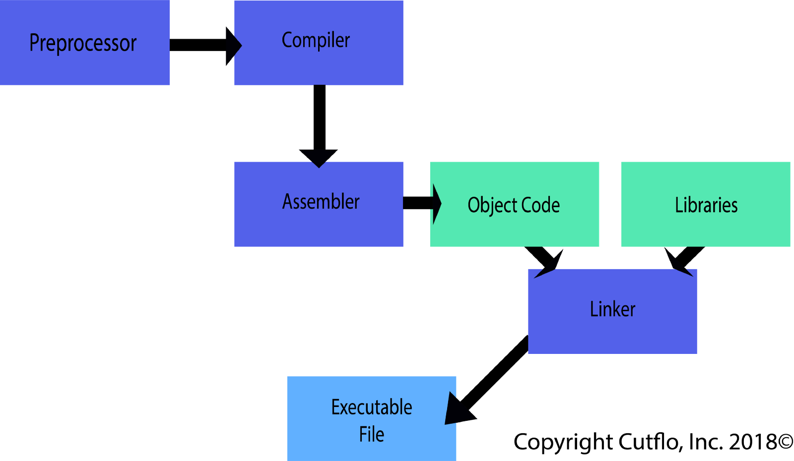

# Assembly

Assembly é uma linguagem de mnemônicos ou seja, um conjunto de símbolos (MOV, JMP, JE, etc) que encodam diretamente binário, sendo assim não existe um processo de "compilação" como conhecemos para linguagens usuais como C ou java e sim um processo direto de tradução desses símbolos para binários.

Como estamos trabalhando na ordem dos binários propriamente ditos isto está na camada do software mais próxima ao hardware, assim esse processo de tradução  dependera para qual arquitetura do processador que estamos utilizando.

Um binário compilado para uma máquina de 64 bits não serve em uma máquina de 32 bits, assim como um binário compilado em arquitetura i386 não funciona em um processador de arquitetura arm.

Portanto sempre que vamos compilar um binário temos que estudar para qual máquina iremos gerar. Para criterio do projeto teremos como foco as máquinas de 32 bits.

Um fato curioso e que usarmemos nesse ep é que binários compilados para máquinas de 32 bits podem rodar em maquinas de 64 bits, claro que utilizando desses 64 bits apenas 32 bits.
A maioria dos computadores modernos utiliza arquitetura de 64 bits, e muito provavelmente a máquina que estamos usando agora é 64 bits e teremos que, por meio dela, compilar um arquivo para arquitetura 32 bits. Para isso usaremos bibliotecas dos sistemas 32 bits junto ao GCC para gerar nossos arquivos, como a **gcc-multilib**.

Para instalar, em linux:

~~~ sh
sudo apt-get install gcc-multilib

~~~

# Assembler

Quando falamos em linguagem Assembly utilizamos um programa que fica responsável por gerar o nosso binário a partir dos mnemônicos da linguagem, como dito anteriormente esse processo não é uma compilação e, como o proprio nome diz, do inglês "Assembler" = montagagem, esse programa se chama **assembler**.
Existem diversos assemblers entre eles o da intel (NASM) e o da GNU (GAS), ambos utilizam diferentes memônicos para o processo de montagem, particularmente recomendo o NASM. (Que foi o que utilizei para estudar as possibilidades do projeto)

# Makefile

Makefiles são arquivos de configuração, essencialmente são semelhantes a programas tipo shell (os famosos aquivos .sh), porém com uma sintaxe mais bem organizada e com um formato mais "inteigente de serem implementados" do ponto de vista de quem esta criando esse arquivo.

O make file é um arquivo composto de diretivas tais como:

~~~
clean:
  rm *.o

diz_oi: clean
  echo "ola"

~~~

Cada uma dessas diretivas executa as ações que estão sob as respectivas identações, dessa forma ao digitarmos no terminal:

~~~ sh
> make clean
~~~

Todos os arquivos que batem com a expressão regular *.o serão apagados do diretorio que contem o makefile.

E se executarmos:
~~~ sh
make diz_oi  
~~~
Inicialmente ele limpa todos os arquivos *.o* do diretorio e então printa "ola"

# Parte 1

## Números Primos

Entre os métodos mais simples de se calcular se um número é primo ou não podemos utilizar o de ir testando a divisibilidade do número a ser testado por todos os números inferiores a ele (começando esse teste a partir do 2, pela indefinição da divisão por 0 e por 1 sempre dividir qualquer número). Inclusive, dessa forma em nosso programa assumimos que 0 e 1 são primos.

Por curiosidade esse algoritmo é relativamente ok em tempo de execução, sendo O(n), com tempo proporcional a ordem de grandeza do primo a ser testado. Existe um método de otimização para esse algoritmo que o deixa proporcional a O(sqrt(n)), que afirma que se *a⋅b=N* onde *1<a≤b<N*
então *N=ab≥a²* assim *a²≤N* então *a≤sqrt(N)*. Segundo essa coisa podemos garantir que se formos até a raiz quadrada do numero N testado e não achamos nenhum divisor então N é primo.
Digo que é por curiosidade aqui pois a raiz quadrada é um tanto quanto complicada de ser implementada em assembly, portanto usaremos o algoritmo que é linear. Caso se sintam encorajados de implementar a raiz em assembly é um otimo exercício para entender como a máquina opera mais a fundo.

## C
Um arquivo em C que pode ser tomado como base para a implementação é o seguinte:

``` C
#include <stdio.h>


int is_prime(int n) {
  //Colocar codigo aqui
}

int main(int argc, char *argv[]) {
  //colocar codigo aqui
  return 0;
}

```

Prestar atenção em algumas coisas: a ordem de declaração das funções importa, logo se a **main** chama a **is_prime** a **is_prime** deve ser declarada antes da **main**.

Outro ponto importante a se notar é em relação as bibliotecas declaradas. A stdlib é a biblioteca de funções padrão de entrada e saida do C, logo precisaremos declará-la no início. Ela nos fornecerá a função **printf** para imprimir coisas no terminal.

Outro ponto são os argumentos passados via terminal; quem nos permite acesso a eles por meio do programa em C é o **argc** e o **argv**. O **argc** armazena a quantidade de argumentos declarados **considerando o nome do programa chamado como um argumento**, logo se temos:

~~~ sh
./sieve 101
~~~

**argc** armazenará o valor 2, e assim **argv** armazenará: [['s','i','e','v','e','\0'], ['1', '0', '1','\0']]

 Logo tudo que é lido do terminal vem na forma de string inclusive o primo lido. Para passarmos para a função **is_prime** necessitamos convertê-lo para int.
 Recomendo fortemente que essa função seja implementada 'bare metal', sem bibliotecas, pois mais para frente não poderemos utilizar nenhuma biblioteca.

 Um ótimo esqueleto para começo do código desta parte do EP é esse:

 ``` C
 #include <stdio.h>


 int is_prime(int n) {
   //Colocar codigo aqui
 }

 int char2int (char *array) {
   //Colocar codigo aqui
 }

 int main(int argc, char *argv[]) {
   //colocar codigo aqui
   return 0;
 }

 ```

 Esse arquivo será compilado via linha de código no terminal utilizando o compilador de arquivos C, o GCC. Recomendo utilizar as seguintes flags de compilação:

~~~ sh
 -O3 -W -Wall -ansi -pedantic
~~~

Consultem a documentação do gcc ou o google (recomendo essa opção) para entender o significado de cada uma delas.


 Um makefile que pode servir de base para esta parte é recomendado ter uma linha de chamada que convencionalmente se chama: **all**, que realiza todos os processos necessários para a compilação, limpeza dos arquivos objeto que serão gerados deixando apenas o executavel e os arquivos fonte no diretorio.
 **clean** que faz a limpeza de todos os arquivos objetos e executaveis no diretorio.
 **sieve** que chama o GCC e compila de fato os arquivos.

 No makefile podemos definir variaveis globais usando, por exemplo:

 ~~~ sh

 CFLAGS= -O3 -W -Wall -ansi -pedantic

 all: sieve

 sieve: sieve.c
 	$(CC) $(CFLAGS) -o sieve sieve.c

 clean:
 	rm -rf *.o sieve

 ~~~

 este é um otimo inicio para um makefile


 # Parte 2

Aqui começa realmente a implementação de coisas em Assembly. Nesta parte temos que entender como que o GCC compila as coisas.
O compilador basicamente converte um código C em um codigo de mais baixo nivel, o assembly, o qual internamente usa um assembler para gerar os binarios que correspondem aos dados que estão encodados no programa. Este arquivo gerado é o que chamamos de arquivo objeto. Um programa é composto de um ou mais arquivos objetos, como por exemplo as bibliotecas que o compoe tambem tem arquivos objetos correspondentes. Assim quando o compilador compila, ate esse momento temos uma sequência de arquivos objeto (.o) que precisam ser ligados, esse processo de ligação chama-se linkage. E quem cuida disso é um utilitario que o próprio GCC vai gerenciar que é o **ld**.

Ou seja quando executamos a linha de compilação:

~~~
gcc -o sieve.c sieve
~~~

O arquivo *sieve.c* sera convertido para linguagem de máquina (Assembly) e então para binário que estará disponível em um *sieve.o*, esse sieve.o se ligara aos *.o* das bibliotecas padrão e então gerara o binario do arquivo executabel *sieve*. O GCC faz esse processo ser basicamente transparente, mas quando trabalhamos com arquivos *.s* necessitamos fazer esse processo manualmente.

Suponha que tenho o seguinte arquivo em C, *soma.c*:

~~~ C
#include <stdio.h>

int add(int a, int b);

int main(int argc, char **argv) {
  printf("%d\n", add(2, 6));
  return 0;
}

~~~

A função add tem sua declaração feita, mas não esta implementada, ao tentarmos compilar esse arquivo com o GCC ele dira que nós não temos nada chamado **add** pra ele colocar no lugar ali. Ou seja, no arquivo *.o* gerado ele tera a declaração mas não a referência para o conteudo do que essa função faz. O que podemos fazer é um "puxadinho no arquivo" incluindo um *.o* na compilação que possua o que essa função faz. Ai que entra o arquivo *.s*.

Suponha que temos o arquivo *sub.s*:
(não nos atentemos as funcionalidades dos mnemônicos do assembly ainda)

~~~
global add

section .data

section .text

add:
    push ebp                        
    mov ebp, esp                    

    mov   eax, [esp+4]   
    add   eax, [esp+8]

    pop ebp
    ret
~~~

Perceba que temos uma tag chamada *add* no arquivo e ela esta identificado no começo como global, e fiz questão de chamar o arquivo de *sub* para reforçar que o que vale é o conteudo e não o nome do arquivo. Inclusive ele poderia se chamar *bsdbjfkbs.ahsdahkl* que daria tudo certo, neste nível da computação apenas os bits importam.

Agora, essencialmente, temos tudo que necessitamos para o programa compilar.
Inicialmente temos que montar o nosso arquivo e quem fara essa tarefa para gerar o nosso *sub.o* é o NASM:

~~~ sh
nasm -f elf sub.s
~~~

Automagicamente será gerado um arquivo *sub.o*
(Outra curiosidade que esse processo de tradução dos mnemonicos pode ser executado manualmente para arquiteturas mais simples como 8 bits, recomendo para quem quiser entender onde o software acaba e o hardware começa a fazer esse processo. Existem emuladores de cpu 8bits como a do z80 para testar o código)

Agora podemos fazer a ligação de todas as partes e para isso podemos usar a linha:

~~~
gcc -o soma add.o soma.c -m32
~~~

Na execução desta linha temos que o GCC verifica que o arquivo *sub.o* já é um objeto, e converte o *soma.c* para *soma.o*, e os linka, gerando o output de nome soma.
A flag **-m32** serve para identificar que a arquiteturapara a qual sera compilada é de 32 bits, e a flag **-o** é para definir o nome do output que será *soma*.  

Para executar o binário basta de um terminal executando dentro do diretorio em questão:

~~~
./soma
~~~

Esse é diagrama de blocos do processo:



 Esse processo aqui apresentado é analogo ao que será executado com o *is_prime.s* e o *sieve_asm.c*. Disuctiremos detalhes da implementação em assembly a seguir.
 No makefile certifique-se de seguir a sequência correta de compilação. Primeiro tem que ser feito o *is_prime.o* para aí sim compilar o *sieve_asm.c*.

 Um ótimo modelo de makefile pode ser na sequência:

 ~~~
 all: sieve_asm

 sieve_asm: sieve_asm.c  is_prime.o
 	FAZ ALGO AQUI

 is_prime.o: is_prime.s
 FAZ ALGO AQUI

 clean:
 	FAZ ALGO AQUI

 ~~~

## O código em assembly:

Quando falamos em assembly temos de ter em vista que trabalhamos com os registradores de memória do processador diretamente. Existem formas de acessar a memória RAM e HD, logicamente, mas para o que usaremos aqui não temos necessidade de nos aprofundarmos nisso.

Os registradores são muito escassos e temos que trabalhar muito bem onde colocamos a informação para que ela não seja corrompida, pois nem todos eles são de uso geral e alguns tem aplicações epecíficas, vamos a lista deles:

Registradores de 32 bits | Função
--------- | ------
EAX | 'A' de Accumulator, nesse registrador que ficará o resultado <br/>das operações aritméticas feitas na ALU (Arithmetic Logical Unit), <br/>porém nada impede de usalo para outras coisas, mas se uma operação <br/>aritmetica for feita o resultado desta operação ira sobrepor o valor que estava lá.
EBX | 'B' de Base, nesse registrador fica o ponteiro para dados, <br/>como em operaçoes com strings, no equivalente ao *printf* <br/>que faremos a base de nossa string (posição do caracter 0)<br/> que será escrita na tela, estará nesse registrador.<br/> Nada impede de usar ele para outras operações.
ECX | 'C' de Counter, utilizado como contador em repetições. <br/>Ele não incrementa automaticamente, e nada impede de <br/>usar ele para outras operações. É apenas um registrador <br/>comum que se convenciona (e realmente é conveniente) <br/>utilizar como contador.
EDX | 'D' de Data, utilizado em operaçoes de Entrada e Saída.<br/> Mas pode ser utilizado como registrador de uso geral.
ESP | 'SP' de Stack Pointer, ponteiro que indica a posição na pilha de execução do programa, incrivelmente importante para chamadas de funções, usando a convenção CEDCL. (entenderemos melhor isso a frente)
EBP | 'BP' de Base Pointer, é o ponteiro que indica a base do stack frame (entenderemos melhor isso a frente)

Existem vários outros registradores, e inclusive esses registradores tem subdivisões internas para 16 e 8 bits, mas para efeito do projeto vamos nos conter a esses, que inclusive so usaremos basicamente o EAX, EBX, ECX, EDX, ESP e EBP.

As instruções da linguagem assembly são muitas, e variam de arquitetura para arquitetura, apesar dos mais básicos essencialmente se preservarem. No inicio da computação o set de mnemonicos era relativamente pequeno (mais de 300, com certeza) quando comparado a hoje pela "pequena" complexidade dos processadores da época, hoje em dia com processadores com unidades de ponto flutuante e operações vetoriais in sílico esse set de instruções é gigantesco. Caso queira se aprofundar consulte os datasheets dos processdores z80 e intel i3 seja qual for a geração para ver a discrepância.

Para esse projeto trabalharemos com instruções para processadores x86 de 32 bits e listarei aqui as principais que eu fortemente recomendo que utilizem (pois sei que da para implementar tudo apenas com elas, porém deixo [aqui](https://www.cs.virginia.edu/~evans/cs216/guides/x86.html) uma referência para uma consulta mais extensa.

Instrução | exemplo | Função
--------- | ------- | ------
mov | Exemplo1: mov eax, 2<br/>Exemplo2 mov eax, ebx | Move o valor 2 para eax<br/> Move o conteúdo de ebx para eax
add| Exemplo1: add ecx, 1 <br/>Exemplo2: add ecx, ebx| Soma 1 em ecx<br/> Soma o conteudo de ebx em ecx
cmp | Exemplo1: cmp eax, 1 <br/>Exemplo2: cmp eax, ebp | Compara o conteudo de eax com 1<br/> Compara eax com ebp
xor | Exemplo: xor eax, eax | Um jeito inteligente de zerar um contador com a operação ou exclusivo, <br/> equivalente a mov eax, 0. Executa a operação xor bit a bit no registrador.
jmp | Exemplo: jmp finish | Salto nao condicional, independente de qualquer coisa vamos para o <br/>trecho do codigo identificado pela label 'finish' (entenderemos melhor a frente)
je | Exemplo je finish | Salto condicionado por uma comparação anterior feita com o CMP, <br/>je de "jump if equal", se a comparação feita em CMP resiultar em<br/> igual ele salta para o trecho de código identificado pela label "finish"
jle | Exemplo je finish | Salto condicionado por uma comparação anterior feita com o CMP, <br/>je de "jump if lesser or equal", se a comparação feita em CMP resultar<br/> em menor ou igual ele salta para o trecho de código identificado pela label "finish"
div | Exemplo: div ecx | divide o conteudo de eax pelo conteudo de ecx, <br/>o quociente da divisão fica em eax e o resto em edx*
push | Exemplo: push ebp | Coloca no topo da pilha de execução do programa o valor que está em ebp.
pop | Exemplo: pop ebp | Retira o valor do topo da pilha de execução do programa e coloca em ebp.
call | Exemplo: call main | Faz o chamado de uma rotina denominada por main.
ret | Exemplo: ret | Após uma chamada de função (call) ele retorna para a execução principal do programa, <br/>como o return ao final das funções em outras linguagens (é exatamente a mesma coisa)
int | Exemplo: int 0x80 | Faz uma chamada a um procedimento do sistema,no caso o de escrita na tela (0x80), <br/>esses valores estranhos são tabelados. <br/>A configuração de como essa chamada se comportara dependera dos valores alocados <br/>nos outros registradores como eax e ebx. (Veremos isso a seguir)

\* como a divisão é o procedimento mais complexo aqui deixo uma imagem ilustrativa que pode ajudar no entendimento:


Antes de seguirmos recomendo que assistam a esse pequeno video explicando sobre o funcionamento de uma pilha de execução do programa. Não se atente a sintaxe que ele usa e nem ao nome dos processadores e sim a como a pilha se comporta. A logica é que sera o importante. [vídeo](https://www.youtube.com/watch?v=5iQkR69H_1M)

Com os registradores também temos como executar operações utilizando ponteiros e não o conteúdo específico desse ponteiro. Exemplo:
Como citado anteriormente ebp armazena o ponteiro para a base da pilha de dados da execução do programa. E suponha que eu queria salvar o valor 10  na posição sequinte a que EBP se encontra. Cada "caixinha" de posição na memória ocupa 4 bytes (Lembrando que cada byte tem 8 bits, totalizando 32 bits, a nossa arquitetura tem exatos 32 bits), entao fazemos:

~~~
mov [ebp+4], 10
~~~

Em um exemplo ilustrativo: ebp aponta para a posição do bit 128 da memória, o próximo bit livre esta em 128 + 32, ou na contagem de bytes 128 bits + 4 bytes, nesta posição poderemos por nosso valor 10 sem que haja corrupção de dados já na memória.

## Estrutura de um arquivo em assembly

Um arquivo em assembly é estruturado por *segmentos ou setores*, resumidamente temos o setor chamado **.data** que é onde ficam armazenadas variáveis e o setor **.text** que é onde fica o codigo em sí. Para fins desse projeto usaremos o setor **.data** vazio (pelo menos nao vi necessidade de uso para ele). A declaração dos setores explicitamente não é necessaria mas ajuda nacompreensão do codigo. Temos tambem as *labels*, que definem começo de trechos de código, e nas declarações para labels globais.
Vamos ver o exemplo anterior mais a fundo:

 ~~~
 global add

 section .data

 section .text

 add:
     push ebp                        
     mov ebp, esp                    

     mov   eax, [esp+4]   
     add   eax, [esp+8]

     pop ebp
     ret
 ~~~

 Temos uma declaração de label global para o trecho identificado pela label add. temos o stor data vazio e o setor text com o conteudo do código.

 vamos ver um segundo exemplo:

 ~~~
 global counter

 section .data

 section .text

 counter:
     push ebp                        
     mov ebp, esp    
     mov   eax, [esp+4]                   
     mov ecx, 0


loopContador:
     cmp eax, ecx
     je finish
     add ecx, 1
     jmp loopContador

finish:
     pop ebp
     ret
 ~~~

 essencialmente neste trexo de código temos o equivalente a, em C:
~~~ C
void count(int n) {
  int i = 0;
  while(i < n) {
    i++;
  }
  return;
}
~~~

Resumindo o código em assembly, temos que isto é uma função chamada counter de acesso global. Ao entramos na label counter temos um aspecto interessante, empilhamos o ebp, e movemos esp para ebp. Isso essencialmente a criação de uma nova pilha sobre a pilha antiga. Senso a ppilha antiga, suponha, as variaveis da execução da função main, e a nova pilha a da função counter invocada pela main, esse proedimento é padrão sempre que ocorre o chamado de uma função. Perceba que agora fazemos a solicitação do endereço de memoria seguinte ao esp, que aponta para o topo da pilha da função main. Isso é devido a que, quando passamos um parametro para a função, segundo a convenção CEDCL, os argumentos são passados em ordem inversa para o topo da pilha, para que a função a ser executada os resgate desse modo.

Na sequência colocamos 0 em ecx (equivalente a i = 0, no código em C), ou seja zeramos nosso contador, e então entramos, sequencialmente na linha do CMP (labels são ignoradas na leitura linear do programa, que compara se eax, é igual a ecx (isto é equivalente a comparação de dentro do while no código em C), se for igual encerra o loop e je direciona o codigo para a label finish, senão incrementamos eax (equivalente ao i++), e damos um salto incondicional novamente para loopContador e reiniciamos o ciclo a partir da localização da flag, ate que a condição eax = ecx seja atendida.

Na label finish temos o desempilhamento do ultimo valor que fizeos push para ebp, ou seja, o retorno para a base da pilha da função main. e então enviamos o comando return para avisar que tudo correu bem. Caso desejassemos retornar algum valor, antes de ser feito o return este deveria ir para eax, por exemplo e o usariamos na função main após o retorno.
Esse procedimento de push e pop para chamado de função, assim como o de passagem de argumento entre funções desta forma é o que se denomina a convenção CEDCL, basicamente.

*Recomendo fortemente fazer a simulação do funcionamento da pilha desenhando em papel para entender o processo*

### Finalmentes desta etapa

Com os códigos assembly aqui exemplificados, como o uso de loop, comparaçoes, chamado de funçoes e ligação entre os arquivos, se da o material inspirador para que seja feito o **is_prime** e a incorporação da função no arquivo *.c*.


## Parte 3

Precisamos para essa etapa nos livrarmos de todas as dependencias externas e construir um programa standalone.
Desta forma teremos de nos livrar principalmente das bibliotecas do sistema que efetivamente executam a função main (inclusive por isso que ela sempre tem que ter esse nome, é uma convenção entre as bibliotecas) e as que gerenciam chamadas ao sistema como a de fazer operaçoes de IO (Input/Output).
Para isso deveremos escrever nossa própria função **printf**, a **print_asm**.

## Iniciando por substituir a função printf

Vemos que para termos o print o prototipo da função print_asm recebe dois argumentos um int que é o tamanho do array de chars e um segundo que é o array de chars propriamente dito.
Em essência isso é exatamente o que o sistema operacional necessita para escrever uma string na tela. (Ressalto aqui apenas uma lembrança, toda string deve ser finalizada com o caracter '\0', que é o finalizador de string), assim a string Juliana seria declarada da seguinte forma:

~~~ C
char s[] = {'J', 'u', 'l', 'i', 'a', 'n', 'a', '\0'};
~~~

para o sistema operacional poder imprimir essa string o ponteiro que aponta para o começo da string deve ficar em ecx, e o tamanho correspondente em edx. Isso ja é a preparação para a escrita na tela.
Na sequencia o registrador ebx deve receber o valor 1, que significara para o sistema que a escrita sera na stdout (terminal onde o programa foi chamado), e eax recebe o número 4 que identifica ao sistema o numero da syscall referente a escrita e na sequencia então usar o comando int 0x80 que envia uma interrupção ao sistema operaciona que ira checar os valores nos registradores para saber o que fazer e então escrever na tela.

Percebamos que nesta função necessitaremos ler dois argumentos passados pela função main, etao teremos que fazer algo analogo a:
~~~
mov eax, [esp+4]
mov ebx, [esp+8]
~~~

Para ler os dois argumentos, lembrando que segundo a CEDCL os argumentos são empilhados em ordem inversa na pilha.

### _start

Neste caso temos de chamar dentro do arquivo _start.s a função main que esta em outro arquivo *.o*, e para isso usaremos a diretiva **extern** no código assembly, que começara assim:
~~~
global _start
extern main
~~~

O sistema operacional se encarregara de passar os argumentos para nossa main por meio do argc e argv semelhante a como operamos com as funçoes, então fazemos um pop na pilha antes de mais nada e esse valor que desempilhamos é argc, que o poremos em ecx, (já que ele é um contador de argumentos), na sequencia faremos a convenção da CEDCL, como é o começo e a pilha acabou de ser formada a partir do ponto que o sistema nos ofereceu nao temos o porque de empilhá-lo.

~~~
mov    ebx, esp
~~~

Com isso acabamos de formar o começo da pilha onde a main trabalhara, agora passamos para a main os argumentos conforme a conveção da CEDCL os empilhando:

~~~
push   ebx  
push   ecx  
~~~

E então executamos um call para a função main:
~~~
call main
~~~

Após a finalização da main temos que noticiar ao sistema operacional que o programa foi finalizado com sucesso retornando 1 em eax e fazendo a chamada ao sistema:

~~~
mov eax, 1
int 0x80
~~~

E isso resolve todos os problemas.
